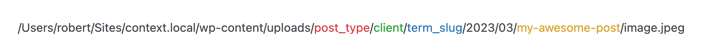
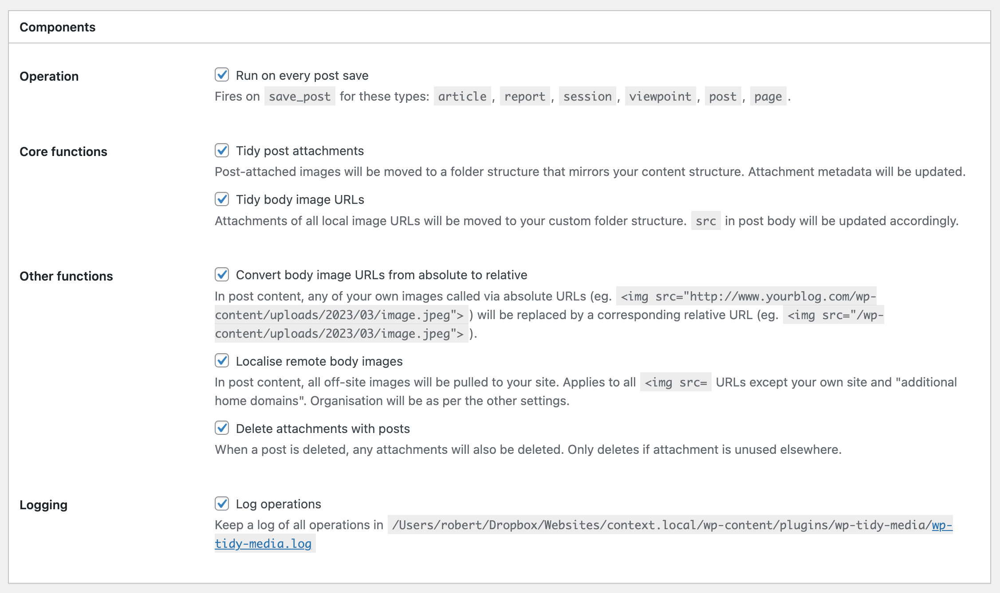
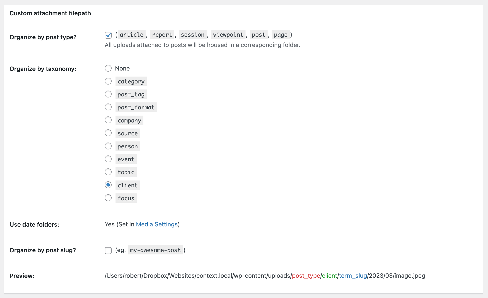
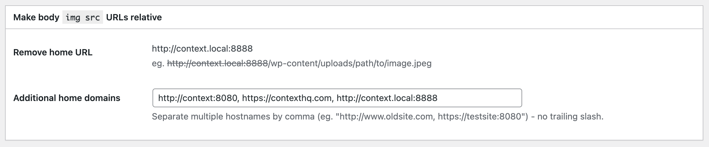

# WP Tidy Media

Tame the WordPress Media Library with a custom `uploads` folder structure.

WordPress does not offer enough personalisation for organising media uploads. With this plugin, users are not beholden to the default:

- `/wp-content/uploads/2023/03/image.jpeg`

Instead, media folders can mimic a site's content structure, with any of these elements:

- `/wp-content/uploads/post_type/taxonomy/term_slug/YYYY/MM/slug-of-the-post/image.jpeg`

For example:

- `/wp-content/uploads/post/client/acme-inc/image.jpeg`
- `/wp-content/uploads/category/technology/macbook.png`
- `/wp-content/uploads/review/cuisine/japanese/sushi-house.jpeg`
- `/wp-content/uploads/2023/03/my-awesome-post/image.jpeg`

## Motivation

WordPress' default media organisation does not scale. My site with 10,794 posts had 9,488 media items. Accounting for the different sizes WordPress generates, this was 22,021 individual files, totalling 2.25Gb, all organised in `YYYY/MM` folders under `/wp-content/uploads`.

Chronology was *not* the natural way organise such a large and disparate set of images.

The posts to which many of these images belong fall into a number of distinct groups. I had already grouped content using taxonomies. I  wanted to batch these images similarly, to make the image folder structure mirror the content structure, and to make potential future migration, perhaps even away from WordPress, smoother.

I once used a combination of existing library management plugins and manual effort to reorganise images. But it was a huge and one-time task that I never wanted to repeat. Instead, I want WordPress to comply with my own media organisation preferences automatically, as I go, and to batch-reorganise images more efficiently.

This required developing a plugin to force WordPress to organise media as I want.

## Features

WP Tidy Media offers the following reorganisation features. Each can be enabled individually:

### 1. Relocate post attachments

Post-attached images will be moved to your specified custom folder structure, which can mirror your content structure. This includes Featured Image and other attachments.

### 2. Relocate other images found in posts

Media of all local image URLs found in post body content (whether attached or not) will be moved to your custom folder structure. ``). This can make site migration - and even local development of a deployed website - complicated, because images will appear broken. By contrast, relative URLs will always point to the image, wherever you host the site.

Any of your own images called via absolute URLs will be replaced by a corresponding relative URL (eg. ``). This does not move images.

### 4. Localise remote body images

All off-site images found in post body content will be pulled to your site. Applies to all `<img src=` URLs except your own site and specified "additional home domains". Organisation will be as per the other settings.

### 5. Delete attachments with posts

When a post is deleted, any attached media will also be deleted. Only deletes if attachment is unused elsewhere.

## Operation

WP Tidy Media can be used in two ways:

1. Run on every post save (optional).
2. Run in bulk from the Posts list, via a button.

You can run on every post save to ensure the library is kept organised in the future.

You can run in batch to reorganise your Media Library retrospectively. If you change your mind, you can change your custom file path after a batch run, and then run again - attachments will be moved again.

In either event, the functions you choose in Options will be executed.

## Options

Access "Tidy Media" settings from beneath the core "Media" menu.

### Components

| Setting                                           | Option         |
| ------------------------------------------------- | -------------- |
| Tidy post attachments                             | Enable/disable |
| Tidy body image URLs                              | Enable/disable |
| Convert body image URLs from absolute to relative | Enable/disable |
| Localise remote body images                       | Enable/disable |
| Delete attachments with posts                     | Enable/disable |
| Log operations                                    | Enable/disable |

### Custom attachment filepath

| Setting                | Option                                 |
| ---------------------- | -------------------------------------- |
| Organise by post type? | Enable/disable                         |
| Organise by taxonomy   | Choose taxonomy, or None.              |
| Use date folders       | (Set in Media Settings)                |
| Organise by post slug? | Enable/disable (eg. `my-awesome-post`) |

### body `img src` URLs relative

| Setting                 | Option                                                                                                   |
| ----------------------- | -------------------------------------------------------------------------------------------------------- |
| Remove home URL         | Shows how the hostname will be removed to construct a relative URL.                                      |
| Additional home domains | Add any other hostnames/domains to strip out (for users who may have `<img src` URLs from legacy sites). |

## Functionality

### Types of attachments

The plugin will act on all three kinds of image files an attachment can represent:

1. Main web-ready image file.
2. Sizes files, for the range of thumbnail and other output sizes.
3. Original image.

[Since 5.3](https://make.wordpress.org/core/2019/10/09/introducing-handling-of-big-images-in-wordpress-5-3/), when an uploaded image is over 2560px in height or width, WordPress downsizes the primary file it will serve and also retains the original.

### Moving attachments

Moving the files alone to your custom folder path is insufficient. This plugin also makes changes to attachments' corresponding database records:

**wp_postmeta**:

- **_wp_attachment_metadata**: Updates the serialised array to reflect new file location.
- **_wp_attached_file**: Updates the relative image path.

**wp_posts**:

- **post_parent**: Where an image is not already attached to another post and is designated to be attached to the current post, this attachment occurs by setting the post's ID as the attachment's post_parent.
- **post_date**: Where a change is being made to an attachment (ie. a reorganisation, or a new image is added to the Media Library), it will take on the date of the post itself. This is to avoid flooding the Media Library with new items.
- **guid**: Where an attachment is being moved, its guid (unique indicator) field will also be updated. Only the sub-directory portion is changed, the domain is not changed. Note: WordPress developers [advise against](https://wordpress.org/documentation/article/changing-the-site-url/#important-guid-note) changing guid for posts. This plugin runs on "attachment" post objects, for which guid is somewhat inconsequential, and is designed primarily for site overhauls which aim to run correct guids.

### Order of operation

Features are run logically in this order:

- Localise remote images.
- Convert body images to relative URLs.
- Relocate other images found in posts.
- Relocate post attachments.

Attachment deletion with post deletion occurs at time of post deletion, if enabled.

## Installation

1. Upload the `wp-tidy-media` folder to the `/wp-content/plugins/` directory.
2. Activate the plugin through the 'Plugins' menu in WordPress.
3. Access "Tidy Media" settings from beneath the core "Media" menu.

## Storage

WP Tidy Media does not store settings in wp_options or any core WordPress database table.

For neatness, it uses its own distinct table, wp_tidy_media_organizer.

This table is created on plugin activation, and a small number of settings is set.

## Removal

The plugin tidies up after itself. Upon deletion, the table wp_tidy_media_organizer is deleted. This removes all traces of the plugin.

Removal will not affect changes already made by this plugin - any attachments already moved will remain in their new locations.

## Warning

Deletion of the plugin will not revert attachments to their prior state.

Running these operations may pose risks to your Media Library.

Make a back-up of both files and database before you run this plugin.

The author cannot be held liable for any data loss.

## Changelog

### 1.0.0

- Initial release

## License

This plugin is licensed under the MIT License - see the [LICENSE](LICENSE) file for details.
