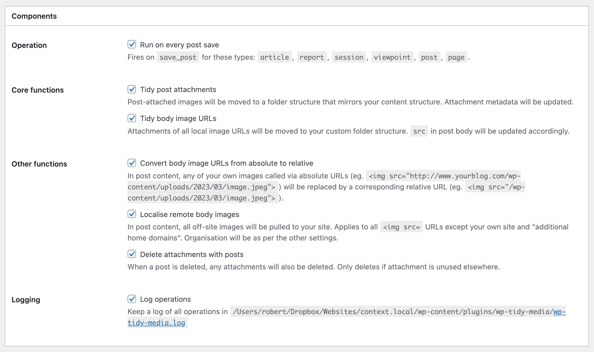
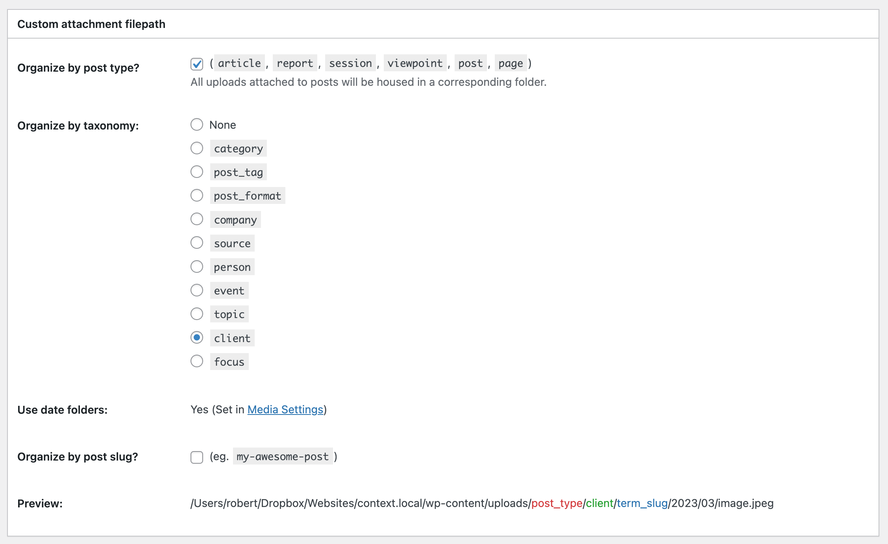
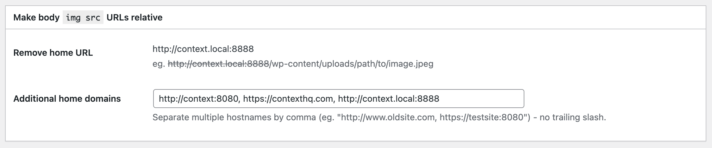

# WP Tidy Media

Tame the WordPress Media Library with a custom `uploads` folder structure.

WordPress does not offer enough personalisation for organising media uploads. With this plugin, users are not beholden to the default:

- `/wp-content/uploads/2023/03/image.jpeg`

Instead, media folders can mimic a site's content structure, with any of these elements:

- `/wp-content/uploads/post_type/taxonomy/term_slug/YYYY/MM/slug-of-the-post/image.jpeg`

For example:

- `/wp-content/uploads/post/client/acme-inc/image.jpeg`
- `/wp-content/uploads/category/technology/macbook.png`
- `/wp-content/uploads/review/cuisine/japanese/sushi-house.jpeg`
- `/wp-content/uploads/2023/03/my-awesome-post/image.jpeg`

## Motivation

WordPress' default media organisation does not scale. My site with 10,794 posts had 9,488 media items. Accounting for the different sizes WordPress generates, this was 22,021 individual files, totalling 2.25Gb, all organised in `YYYY/MM` folders under `/wp-content/uploads`.

Chronology was not how I wanted to organise these images. The truth is, the posts to which many of these images belong fall into a number of distinct groups. I had already grouped content using taxonomies. I also wanted to batch these images, to make the image folder structure mirror the content structure, and to make potential future migration, perhaps even away from WordPress, smoother.

I once used a combination of existing library management plugins and manual effort to reorganiase images. But it was a huge and one-time task that I never wanted to repeat. Instead, I want WordPress to comply with my own media organisation preferences automatically, as I go.

This required developing a plugin to force WordPress to organise media as I want.

## Features

WP Tidy Media offers the following reorganisation features. Each can be enabled individually:

### 1. Relocate post attachments

Post-attached images will be moved to your specified custom folder structure, which can mirror your content structure. This includes Featured Image and other attachments.

### 2. Relocate other images found in posts

Media of all local image URLs found in post body content (whether attached or not) will be moved to your custom folder structure. ``). This can make site migration - and even local development of a deployed website - complicated, because images will appear broken. By contrast, relative URLs will always point to the image, wherever you host the site.

Any of your own images called via absolute URLs will be replaced by a corresponding relative URL (eg. ``). This does not move images.

### 4. Localise remote body images

All off-site images found in post body content will be pulled to your site. Applies to all `<img src=`URLs except your own site and specified "additional home domains". Organisation will be as per the other settings.

### 5. Delete attachments with posts

When a post is deleted, any attached media will also be deleted. Only deletes if attachment is unused elsewhere.

## Operation

WP Tidy Media can work in two ways:

- Run on every post save (optional).
- Run in bulk from the Posts list, via a button.

You can run in batch to reorganise your Media Library retrospectively. You can run on every post save to ensure the library is kept organised going forward.

In either event, the functions you choose in Options will be executed.

## Options

### Components

**Operation**:
- [ ] Run on every post save

**Core functions**:
- [ ] Tidy post attachments:
- [ ] Tidy body image URLs

**Other functions**:
- [ ] Convert body image URLs from absolute to relative
- [ ] Localise remote body images
- [ ] Delete attachments with posts

**Logging**:
- [ ] Log operations

### Custom attachment filepath

This is where you compose your preferred path for media uploads.

**Organise by post type?**
- [ ] Enable/disable

**Organise by taxonomy**:
- Choose taxonomy, or None.

**Use date folders**:
- (Set in Media Settings)

**Organise by post slug?**

- [ ] Enable/disable (eg. `my-awesome-post`)

### Make body `img src` URLs relative

**Remove home URL**:
- Shows how the hostname will be removed to construct a relative URL.
- Additional home domains: add any other hostnames/domains to strip out (for users who may have `<img src` URLs from legacy sites).

## Installation

1. Upload the `wp-tidy-media` folder to the `/wp-content/plugins/` directory.
2. Activate the plugin through the 'Plugins' menu in WordPress.
3. Go to the 'Posts' screen in the WordPress admin area to see the new custom column.

## Changelog

### 1.0.0

* Initial release

## License

This plugin is licensed under the MIT License - see the [LICENSE](LICENSE) file for details.
